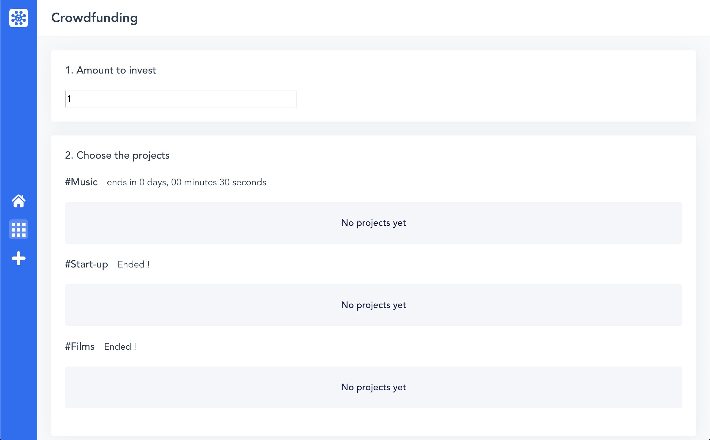

# ethparis-collective

## Inspiration

The crypto ecosystem is famous for innovative crowdfunding mechanisms like ICOs and newer alternatives like GitCoin Grants. However, funding decisions are done on an individual level: this means that most of the times the community disperses its resources into many little trickles.

We decided to create Collective because we believe that pooling and coordination can make for a much more effective funding strategy.

This is possible thanks to crypto economics and technologies. The Collective crowdfunding platform incentivizes early and long-term commitment of investors in return for valuable voting rights, creating an ecosystem similar to a Token Curated Registry, where the value of the token is measured also by the influence it grants on the platform ecosystem.

## What it does

Collective is a crowdfunding platform for the crypto ecosystem. It is a web app with an intuitive, Reddit-like UI. The CVTs are minted according to a Token Bonding Curve: early investors benefit from a lower price, and the price of the CVT is linked to the total supply.

Users in search of funding can submit a project to which supporters can send CVT. At the end of a predetermined time period the total funds pool gets redistributed to the best projects. Then the users can reconvert the CVT to the original DAI token to make their project real.

The funding distribution protocol rewards projects that were able to concentrate CVT, redirecting to them the small pledges given to other projects. Our goal is to concentrate the funding to a limited number of worthy proposals.
 This number depends on the total funding pool.

Funders can pledge monthly investments in DAI, paid out on a monthly basis. In return for their monthly pledge funders receive a CVT bonus that gets bigger as long as they keep funding the platform.

The CVT is a ERC20 token that can be transferred and traded on the open market. Investors can liquidate their CVT or choose to keep them to retain influence on the platform.

The characteristics of a Token Bonding Curve make it extremely costly to try to acquire the majority of the voting power (51% attack), since as the demand increases, so does the price. To avoid front-running attacks we implemented a maximum gas limit when minting and burning CVTs.

## How we built it

The central part of the project is the smart contract managing project creation and funding. We extended a Continuous Token based on Token Bonding Curves to create the Collective Voting Token (CVT). We integrated a recurring-payments-system smart contract (based on the EIP 1337 standard) to allow funders to subscribe to the platform and help creators with a long-term vision. We incentivize subscriptions by discounting the CVT price based on the user fidelity. The subscription transactions are executed by a relayer node.

The contracts are deployed on a SKALE sidechain. We benefit from SKALE's high-speed and low-cost transactions to improve the user experience. This is especially important for our use case because of the amount of data we manage and the resulting high costs we would have to sustain with a normal blockchain. Furthermore, the SKALE blockchain provides Collective with an integrated file-storage system that we employ as a decentralized database for the projects' data.

We take advantage of the Openzeppelin-solidity github repository.

The frontend is built with vuejs and web3, and the interaction with the blockchain is mediated by metamask.

## Challenges we ran into

The main challenge we faced has been the integration of the various smart contracts: the subscription layer mediates between the users and the CVT smart contract, allowing to schedule future recurring payments.

## Accomplishments that we're proud of

- Integrating a complex backend comprising many smart contracts in a very intuitive and simple user interface.
- Staying awake for 2 days

## What we learned

- Integration of vuejs and web3js in the frontend
- How to deploy and work with a SKALE side chain
- [Token Bonding Curves](https://blog.relevant.community/how-to-make-bonding-curves-for-continuous-token-models-3784653f8b17) and [Token Curated Registry](https://medium.com/@tokencuratedregistry/the-token-curated-registry-whitepaper-bd2fb29299d6)
- [Recurring transaction](https://github.com/gitcoinco/ERC-1337) and events scheduling in a smart contract

## What's next for Collective

Collective offers the tools to experiment with a novel approach to a complex problem: as a platform it can pool  and concentrate funds on worthy projects, like Ethereum Improvement Proposals. In the quest for fruitful fund allocation, it's comparable to the Moloch DAO. As a ERC20 token, it introduces a combination of novel concepts (e.g. Token Curated Registry, Token Bonding Curves, Subscriptions).

Our goal is to finish and deploy a working product in the next 6 months. In order to do this, we are going to extensively test and improve the smart contracts, with a particular focus on data privacy. To create the best possible user experience, we are going to fully exploit the SKALE side chain capabilities by removing the extra complexity layer introduced by metamask.

## Screens

